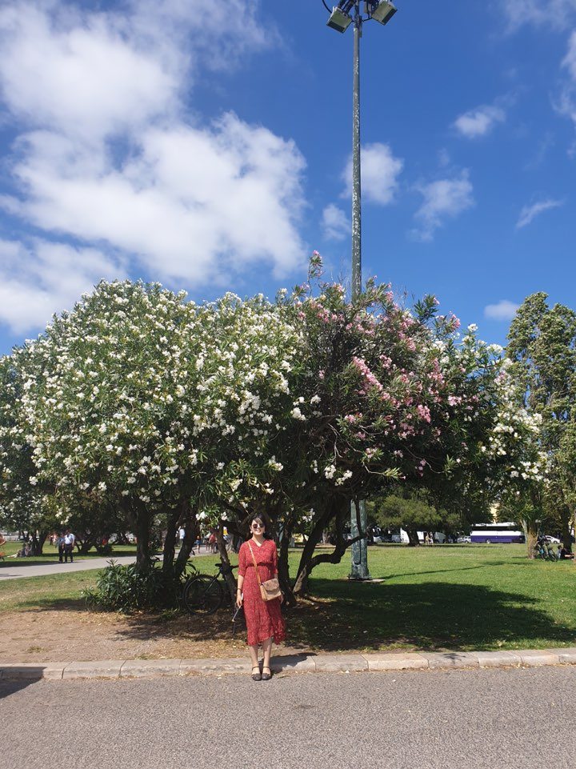

 Hi there!🙋‍♀️ Welcome to my site. The posts are mainly for organizing my research. My research interests are in the area of applying Machine learning and data science to solve real world issues. I am particularly interested in solving the problems of developmental issues-such as mitigating poverty, empowering sustainable growth and economic growth; I would like to apply rigorous algorithms to leverage data driven analysis. If you have any comments or questions, feel free to contact me via my <a href="mailto:sullamij@gmail.com">mail</a> 

